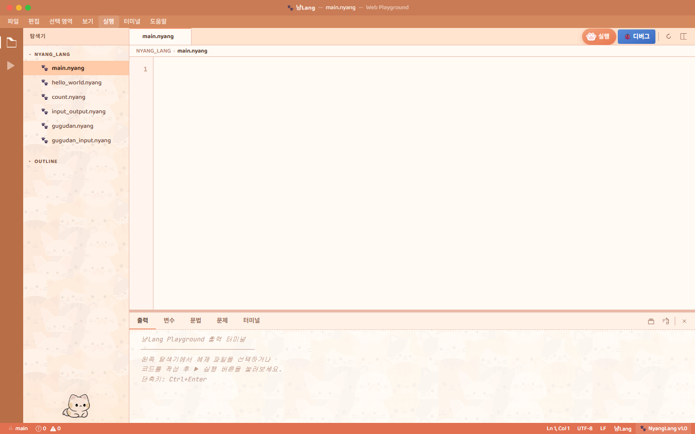

# NyangLang 🐱
> 고양이 울음소리로 작성하는 난해한 프로그래밍 언어 (Esolang)

<p align="center">
  
</p>

**NyangLang**은 `냥`, `냐` 등 한국어 고양이 울음소리를 기반으로 설계된 난해한(Esolang) 프로그래밍 언어입니다.  
인간이 보기엔 귀엽고 난해하지만, 컴파일러/파서 관점에서는 엄격한 규칙을 갖습니다.

이 프로젝트는 **언어 설계 → 렉서 → 파서 → 인터프리터 → LLVM 컴파일러 백엔드 → CLI → 웹 플레이그라운드**까지의 전체 툴체인을 직접 구현합니다.

```
냥??야옹 냥냥??야옹     # 변수1, 변수2 입력
냥~야옹 냥냥~야옹       # 스택에 push
냐냐~야옹 냥냥냥~~야옹  # 덧셈 → 변수3 저장
냥냥냥!?야옹            # 변수3 출력
```


## 특징

- 🐱 고양이 울음 기반 문법 (`냥`, `냐`, `.`, `~`, `!`, `?`)
- 📦 번호 기반 변수 시스템 (변수1, 변수2, …)
- 🔢 스택 기반 연산 모델
- ⚡ **인터프리터** + **LLVM 네이티브 컴파일러** 이중 백엔드
- 🖥️ CLI (`nyang run` / `nyang build`) 지원
- 🌐 웹 플레이그라운드 (FastAPI + Jinja2) 지원
- 🚀 인터프리터 대비 **약 251배 빠른** LLVM 컴파일 실행
- 📐 배열 자료구조 지원


## 프로젝트 구조

```
NyangLang/
├── src/nyang/
│   ├── _00_types.py          # Token, Command, CommandKind 타입 정의
│   ├── _01_lexer.py          # 렉서 (소스 → 토큰)
│   ├── _02_parser.py         # 파서 (토큰 → Command 리스트)
│   ├── _03_interpreter.py    # 인터프리터 (PC 기반 실행)
│   ├── _04_cli.py            # CLI 진입점 (nyang run / nyang build)
│   └── _05_llvm_codegen.py   # LLVM 컴파일러 백엔드 (llvmlite)
│
├── web/
│   ├── app.py                # FastAPI 웹 플레이그라운드
│   ├── templates/index.html  # VS Code 스타일 플레이그라운드 UI
│   └── static/               # CSS, 이미지
│
├── examples/
│   ├── 00_ex.nyang           # 두 수를 입력받아 합 출력
│   ├── 01_ex.nyang           # 'A' 문자 출력
│   ├── 02_ex.nyang           # 스택/변수 테이블 디버그 출력
│   ├── 03_ex.nyang           # Hello World!
│   ├── 04_ex.nyang           # 홀짝 판별
│   ├── 05_ex.nyang           # 구구단 (2~9단 전체)
│   ├── 06_ex.nyang           # 구구단 (입력받은 단)
│   ├── array_ex.nyang        # 배열 예제
│   ├── bubble_sort.nyang     # 버블 정렬
│   └── bench.nyang           # 10만 루프 벤치마크
│
├── docs/
│   ├── 00_변수 연산자 문법.md
│   ├── 01_사용자 입출력 문법.md
│   ├── 02_점프문.md
│   └── 03_배열.md
│
├── benchmark.py              # 인터프리터 vs LLVM 속도 비교
├── test_all.py               # 전체 자동 테스트
└── pyproject.toml
```


## 설치 및 실행

### 1. 환경 설정

```bash
python -m venv .venv

# bash
source .venv/Scripts/activate

# PowerShell
.\.venv\Scripts\Activate.ps1

pip install -r requirements.txt   # 의존성 설치 (llvmlite, fastapi 등)
pip install -e .                  # nyang CLI 명령 등록
```

### 2. 인터프리터로 실행

별도 빌드 도구 없이 바로 실행됩니다.

```bash
nyang run examples/00_ex.nyang
```

### 3. LLVM으로 컴파일 후 실행

> **사전 요구사항**: 링킹을 위해 `gcc`가 필요합니다.
> - **Windows**: [MSYS2](https://www.msys2.org/) 설치 후 `pacman -S mingw-w64-x86_64-gcc`, 이어서 `C:\msys64\mingw64\bin`을 PATH에 추가
> - **Linux**: `sudo apt install gcc`
> - **macOS**: `xcode-select --install` (`gcc` 명령이 clang에 연결됨)

```bash
nyang build examples/00_ex.nyang   # → 00_ex.exe 생성
./examples/00_ex.exe
```

### 4. 빌드 옵션

```bash
nyang build examples/00_ex.nyang --ir    # LLVM IR 텍스트 출력
nyang build examples/00_ex.nyang --asm   # x86 어셈블리 텍스트 출력
```

### 5. 웹 플레이그라운드

```bash
uvicorn web.app:app --reload
# → http://localhost:8000
```

VS Code 스타일 IDE 레이아웃으로, 예제 파일 탐색 · 코드 편집 · 실시간 실행을 지원합니다.



### 6. 전체 테스트

```bash
python test_all.py
```


## 문법

> **핵심 규칙**: 모든 명령문은 `야옹`으로 끝나며, `냥`의 개수가 변수/배열 번호(ID)가 됩니다. 모든 연산은 스택 기반으로 동작하고, `야옹` 외의 문자는 주석으로 간주됩니다.

상세 문법은 `docs/` 폴더의 명세 문서를 참고하세요.

| 문서 | 내용 |
|------|------|
| [변수·연산자 문법](./docs/00_변수%20연산자%20문법.md) | 기본 개념, 정수 리터럴, 변수 선언·대입, 사칙연산 |
| [사용자 입출력 문법](./docs/01_사용자%20입출력%20문법.md) | 입력, 출력 12가지 조합, 디버깅 출력 |
| [점프문 문법](./docs/02_점프문.md) | 조건 분기, 반복문, 동적 점프 |
| [배열 문법](./docs/03_배열.md) | 배열 생성·쓰기·읽기·입력 |


## 예제

### 두 수의 합

```
냥??야옹 냥냥??야옹 냥냥냥.,야옹    # 변수1, 2 입력, 변수3 = 0
냥~야옹 냥냥~야옹                   # 변수1, 2를 스택에 push
냐냐~야옹 냥냥냥~~야옹              # 덧셈 → 변수3에 저장
냥냥냥!?야옹                        # 변수3 출력
```

### 1~5 출력 (반복문)

```
냥.야옹           # (1) 변수1 = 1
냥냥.....야옹     # (2) 변수2 = 5 (카운터)
냥!?야옹          # (3) 변수1 출력
냥~야옹 .~야옹    # (4~5) 변수1, 1을 스택에 push
냐냐~야옹         # (6) 덧셈
냥~~야옹          # (7) 변수1 = 변수1 + 1
냥냥~야옹 ,~야옹  # (8~9) 변수2, -1을 스택에 push
냐냐~야옹         # (10) 덧셈
냥냥~~야옹        # (11) 변수2 = 변수2 - 1
냥냥?...야옹      # (12) 변수2 ≠ 0이면 3번 라인으로 점프
```

### Hello World!

```
..........~야옹 .......~야옹
냐냐냐냐~야옹 냥~~야옹 냥~야옹 ..~야옹 냐냐~야옹 냥~~야옹
냥!!??야옹
...
```


## 벤치마크 (10만 루프)

```
$ python benchmark.py

인터프리터:  4.434 초
LLVM exe:    0.018 초
─────────────────────
속도 향상:   251 배
```

LLVM 백엔드는 NyangLang 소스를 LLVM IR로 변환 후 네이티브 기계어 `.exe`로 컴파일합니다.  
llvmlite를 사용하며, Windows에서는 콘솔 UTF-8 출력(`SetConsoleOutputCP`)을 자동 설정합니다.


## 아키텍처

```
소스 (.nyang)
    │
    ▼
렉서 (_01_lexer.py)         → Token 리스트
    │
    ▼
파서 (_02_parser.py)        → Command 리스트 (한 라인에 여러 커맨드 가능)
    │
    ├──▶ 인터프리터 (_03_interpreter.py)   → 직접 실행
    │
    └──▶ LLVM 코드젠 (_05_llvm_codegen.py)
              │
              ├── LLVM IR  (--ir 옵션)
              ├── x86 ASM  (--asm 옵션)
              └── LLVM IR → 오브젝트(.o) → gcc 링킹 → .exe
```

### 실행 흐름

1. **렉서**: 소스 코드를 한 줄씩 읽어 의미 있는 토큰(냥, 냐, ., ,, ~, !, ?, 야옹)으로 분리
2. **파서**: 토큰을 분석하여 `Command` 객체 리스트로 변환 (한 줄에 여러 커맨드 가능)
3. **인터프리터**: PC(Program Counter) 기반으로 커맨드를 순서대로 실행, 점프문으로 PC 이동
4. **LLVM 코드젠**: 커맨드를 LLVM IR로 변환 → llvmlite로 네이티브 오브젝트(.o) 생성 → gcc로 링킹


## 제한사항 및 향후 계획

- **한글 출력(초성·중성·종성 분해)은 현재 미구현**입니다. 향후 추가할 계획입니다.
- ASCII 문자 출력(`!!`)은 정상 지원되므로 영문/기호 출력은 가능합니다.


## 팀

> 도전학기제 그룹 과제 — 그룹명 **집사**

| 이름 | 학번 | 역할 |
|------|------|------|
| 허민엽 | 2020290 | 팀장 및 언어 코어 설계 |
| 이창민 | 2242973 | 인터프리터 및 백엔드 |
| 윤승희 | 2243175 | 웹 IDE (프론트엔드) |
